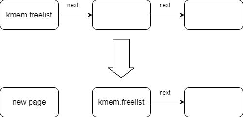

# lab2 实验报告

赵文轩 18307130104

[toc]

lab2主要实现的是内核的内存管理，需要实现的函数有 kalloc，kfree，map_region，vm_free 四个函数。

## 函数分析

### kalloc

​	kalloc 需要分配一个 4096 bytes 的空页，并返回指向页开头的指针。

​	内核定义了 kmem 来管理空页表。kmem 使用链表结构，每个空页表使用 run 类来维护。run 类在当前页的开头记录了指向的下一个空页的地址。kmem中的 free_list 指向的是链表的开头。

​	因此 kalloc 需要做的事情就是从 kmem 维护的空页表链表中取出一个空页表，同时维护 kmem 中的链表正确。操作示意图如下。

### kfree

​	kfree 需要将给定的页表加到可分配的空页表链表中，进行的就是 kalloc 的逆操作。

### map_region

​	map_region 将选定的虚拟地址区域映射到目标物理区域。由于给出的 va 不一定对齐，所以需要首先进行 ROUNDDOWN 操作，将首地址和尾地址页对齐。通过 pgdir_walk 找到最后一级（也就是第三级）的页表对应的 entry，从而完成映射。	

### pgdir_walk

​	pgdir_walk 逐级查询页表，最后返回查询的虚拟地址对应的页表条目（PTE，Page Table Entry），ARM 架构的页表查询如下图所示。

​	pgdir_walk 还可以选择在查询过程中创建页表，相当于一个初始化的过程。

### vm_free

​	vm_free 给定页表和给定页表的级数，清空页表和页表所有的PTE。

​	vm_free 采用递归结构，在前三级查询页表并递归调用 vm_free，第四级对页表的每个PTE对应的页表调用 kfree 进行释放操作。在函数返回前调用 kfree 清空当前页表。

## 问题解析

### 页表解析问题

​	当前实现的页表一共四级，每级 9 位，最后 12 位用来在最后一页定位。这样的设计是因为四级页表中的 PTE 是 64 位的，因此每个 PTE 需要占用 8 byte，也就是最后 3 位的定位是不需要的，因此只需要 9 位数字来寻址。

​	~~这也能解释在 pgdir_walk 中 PTE 的定位是 `(uint64_t)pg | (PTX(level, va) << 3)` 而不是 `(uint64_t)pg | PTX(level, va)`。同理，在 vm_free 中，逐个查询 PTE 是 8 位一次进行的。~~

​	由于 pg 是 uint64_t 类型的指针，所以不需要左移 3 位再进行寻址。同理，vm_free 中不需要 8 位一次进行查询。如果 pg 是 char\* 类型的话应该是需要左移的。

### 清空问题

​	由于每个 run 类的 next 成员储存在页表的开头，因此 kalloc 中在清空页表之前要先保存 next 成员的信息。

​	同样的，在清空页表之后，查看页表的开头也会是 next 成员的信息而不是清空的数值。

## 测试设计

​	lab2 代码测试分成两个部分：map_region 的正确性、vm_free 的正确性。

​	map_region 的测试的关键在于将 map_region 的 pg_dir 参数设定成一个新分配的页表，映射完成后，用该页表替换 ttbr0_el1，直接访问物理地址就可以检查页表的配置是否正确。

​	vm_free 的测试关键在于上一节中讲到的页表开头是 next 成员信息，因此需要跳过这一部分的检查。